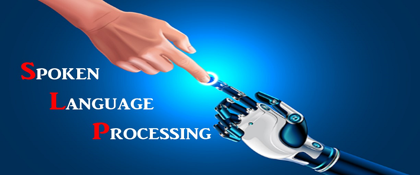

# A GUIDE TO SPOKEN LANGUAGE PROCESSING

This Repository will guide you to understanding the building blocks,terminology,importing and manipulating audio files and ending up turnig audio into text and doing some sentiment analysis.

## EVOLUTION 
- SPOKEN LANGUAGE PROCESSING is rapidly advancing due to the increased interest in human to machine communications plus the advancements of "BIG DATA" and computing power. Decades back humans used punch cards to communicate with computers now everyone is able to just say "hello SIRI" or "Alexa" and the machine will reply "yes Sam already calling your mother" :joy:. In that instance the machine activated,understood the task and executed it and gave feedback all in seconds.

## LET'S BEGIN WITH SOME QUESTIONS

- WHAT IS SPOKEN LANGUAGE PROCESSING OR NATURAL LANGUAGE PROCESSING

  * This is an intersection of Data Science and AI(Artificial Intelligence) that teaches machines how to understand human languages and extract meaning from text.

- WHY SLP/NLP

    * Helps computers to communicate with humans in their own language
    * It makes it possible to read text, hear text, interpret it, measure sentiment analysis and analyze which parts are important.

- WHAT APPLICATIONS CAN THIS BE USED FOR

    * Smart Assistans/Order Processing
    * ChatBots or Conversational Speech Synthesis
    * Text,media translatio
    * Summarizing text in academic papers
    * Help doctors and patients communicate better by streamlining patient information

- HOW TO START WITH SLP

    * First you have to know the tools need which we'll cover in the notebooks such as:[NLTK,SpaCy,PyDub,wave,TextBlob,Scikit-Learn]
    * Secondly the steps to building a SLP application
        * 1-Importing audio files
        * 2-Using Speech Recognition
        * 3-Manipulating audio file with PyDub
        * 4-Processing transcribed text from Spoken Language
        * 5-Doing Sentiment Analysis

